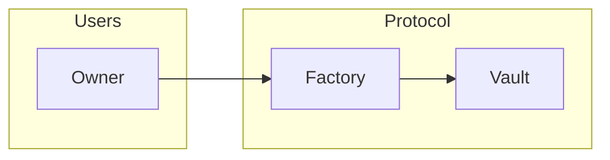
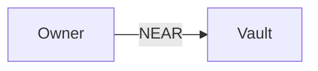
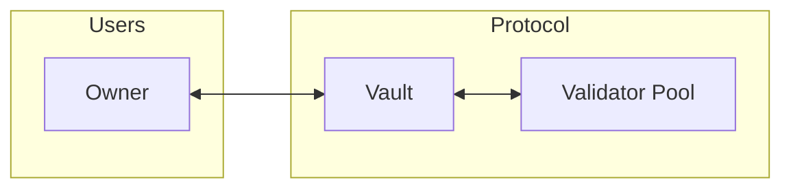
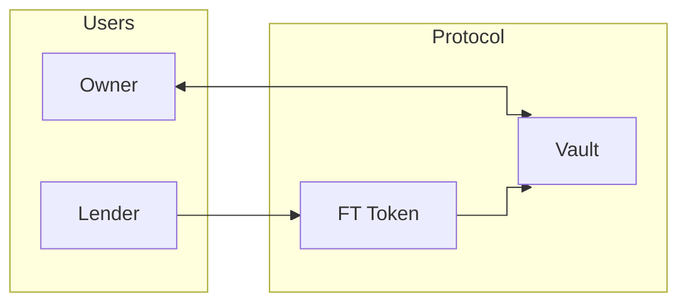
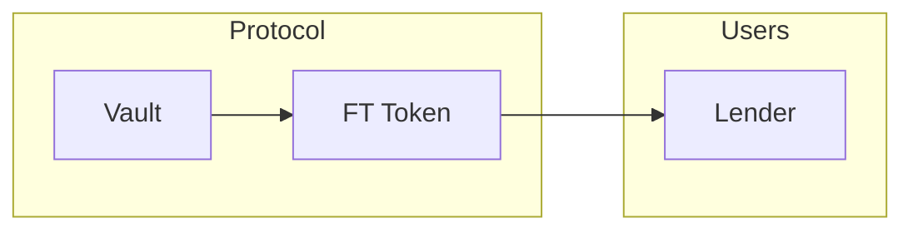
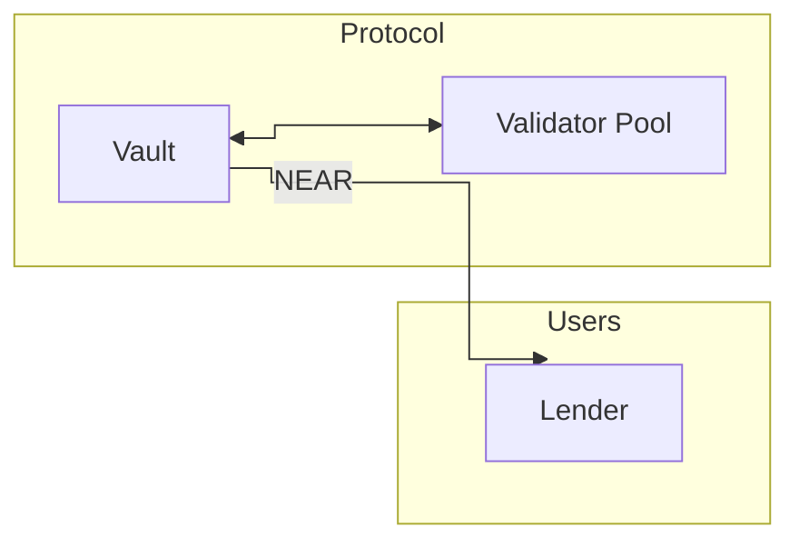
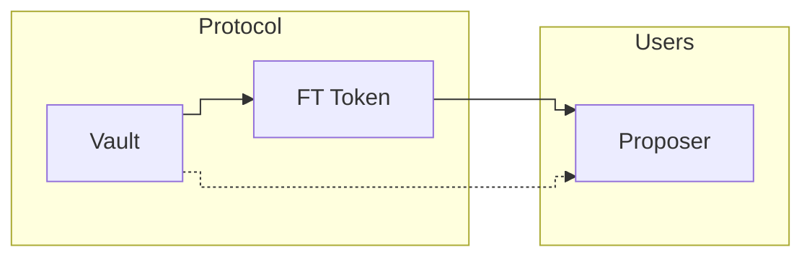
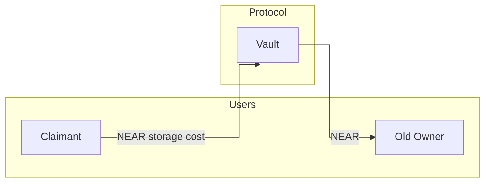
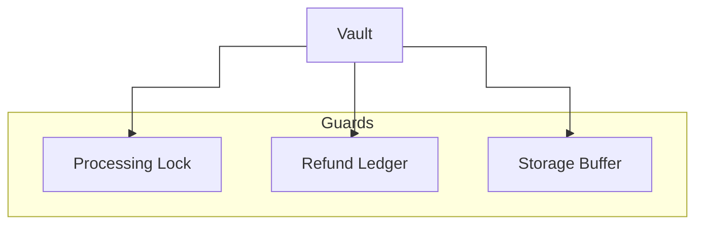

# SudoStake (NEAR) — Value Flows

A short, sectioned guide showing how funds move through the Vault. Each section has a diagram and just enough rules to integrate safely. Diagrams are Mermaid and render on GitHub.

Glossary
- Factory: Contract that mints per‑user Vaults (as subaccounts) and charges a minting fee.
- Vault: User‑owned contract/account that holds NEAR/FTs, stakes, requests liquidity, repays, and may be liquidated.
- FT: NEP‑141 fungible token (e.g., USDC equivalents on NEAR).
- Validator Pool: Standard NEAR staking pool contract.
- yoctoNEAR: 10^-24 NEAR, the minimum attached deposit required for many permissioned calls.


1) Create a vault
- Call `mint_vault` on the Factory with exactly the mint fee attached.
- Factory creates `vault-<index>.<factory_id>`, deploys `vault.wasm`, initializes it.
- Any leftover NEAR remains as Factory revenue.




2) Fund your vault (NEAR in)
- Send NEAR directly to the Vault account name.
- Balance increases immediately; no method call needed.




3) Staking lifecycle

- Up to `MAX_ACTIVE_VALIDATORS` active validators (currently 2).
- Long operations run under a processing lock to avoid overlaps.

Delegate (stake)
- Call: `delegate(validator, amount)`, attach 1 yoctoNEAR.
- Preconditions:
  - Owner only; `amount > 0`; `amount <= available` (respects storage buffer).
  - No pending refunds; no liquidation in progress.
  - New validator does not exceed `MAX_ACTIVE_VALIDATORS`.
- Action: `deposit_and_stake(amount)` on the validator pool.
- Emits: `delegate_completed` on success; `delegate_failed` on failure.
- State: Validator added to `active_validators` on success.

Undelegate (start unlock)
- Call: `undelegate(validator, amount)`, attach 1 yoctoNEAR.
- Preconditions:
  - Owner only; `amount > 0`.
  - `validator` is in `active_validators`.
  - No open liquidity request.
- Action: `unstake(amount)`, then view remaining staked balance.
- Emits: `undelegate_completed` on success; `undelegate_failed` on failure; `validator_removed` if balance becomes zero.
- State: Records `UnstakeEntry { amount, epoch_height }` for the validator.

Claim (withdraw unlocked)
- Call: `claim_unstaked(validator)`, attach 1 yoctoNEAR.
- Preconditions:
  - `UnstakeEntry` exists and `epoch >= entry.epoch_height + NUM_EPOCHS_TO_UNLOCK` (4).
  - No liquidation in progress.
- Action: `withdraw_all()` on the validator pool.
- Emits: `claim_unstaked_completed` on success; `claim_unstake_failed` on failure.
- State: Clears `UnstakeEntry`; liquid NEAR returns to the Vault balance.

Notes
- Rewards accrue while staked and become withdrawable after unlock + withdraw.
- Delegation is blocked when refunds are pending or liquidation is active.

Example timeline (epochs)
- E100: Owner calls `delegate(pool.stakehouse.near, 50 NEAR)` — funds become staked.
- E102: Owner calls `undelegate(pool.stakehouse.near, 10 NEAR)` — records `UnstakeEntry { amount: 10 NEAR, epoch_height: 102 }`.
- E106: Earliest epoch when `claim_unstaked` is allowed (102 + NUM_EPOCHS_TO_UNLOCK = 4).
- E106+: Owner calls `claim_unstaked(pool.stakehouse.near)` — Vault executes `withdraw_all()`, liquid NEAR returns to the Vault’s balance.

Event JSON examples
- Events are emitted as log lines prefixed with `EVENT_JSON:`.

Example — delegate (success)
```
EVENT_JSON:{
  "event": "delegate_completed",
  "data": {
    "vault": "vault-0.factory.near",
    "validator": "pool.stakehouse.near",
    "amount": "50000000000000000000000000"
  }
}
```

Example — delegate (failure)
```
EVENT_JSON:{
  "event": "delegate_failed",
  "data": {
    "vault": "vault-0.factory.near",
    "validator": "pool.stakehouse.near",
    "amount": "50000000000000000000000000",
    "error": "deposit_and_stake failed"
  }
}
```

Example — undelegate (success)
```
EVENT_JSON:{
  "event": "undelegate_completed",
  "data": {
    "vault": "vault-0.factory.near",
    "validator": "pool.stakehouse.near",
    "amount": "10000000000000000000000000"
  }
}
```

Example — undelegate (failure)
```
EVENT_JSON:{
  "event": "undelegate_failed",
  "data": {
    "vault": "vault-0.factory.near",
    "validator": "pool.stakehouse.near",
    "amount": "10000000000000000000000000",
    "error": "unstake failed"
  }
}
```

Example — validator removed from active set (after balance check)
```
EVENT_JSON:{
  "event": "validator_removed",
  "data": {
    "vault": "vault-0.factory.near",
    "validator": "pool.stakehouse.near"
  }
}
```

Example — claim unstaked (success)
```
EVENT_JSON:{
  "event": "claim_unstaked_completed",
  "data": {
    "vault": "vault-0.factory.near",
    "validator": "pool.stakehouse.near"
  }
}
```

Example — claim unstaked (failure)
```
EVENT_JSON:{
  "event": "claim_unstake_failed",
  "data": {
    "vault": "vault-0.factory.near",
    "validator": "pool.stakehouse.near",
    "error": "withdraw_all failed"
  }
}
```




4) Liquidity: request, offers, accept
- `request_liquidity`: Owner posts request (token, amount, interest, collateral, duration).
- Lenders send `ft_transfer_call` with `NewCounterOffer` or `AcceptLiquidityRequest`.
- Owner may accept a single counter offer; non‑winners are refunded.




5) Repay
- `repay_loan`: Owner triggers repayment of principal + interest in the requested token.
- Vault calls `ft_transfer` to pay the lender. On success, loan state clears.




6) Liquidation (after expiry, NEAR out)
- Anyone can call `process_claims` after expiry of an accepted request.
- Pay order: liquid NEAR → matured unstaked → new unstaking (callbacks, lock‑guarded).
- State clears when total due is paid.




7) Refunds and retries
- Refunds use `ft_transfer` (for tokens) or NEAR transfer; failures are saved to `refund_list`.
- Anyone entitled (owner or proposer) can retry refunds by ID; success removes the entry.




8) Ownership and takeover
- `transfer_ownership`: Owner changes the owner field (no value transfer).
- `claim_vault`: Anyone can claim a listed vault by attaching exactly the storage cost.
  - Vault forwards that NEAR to the old owner; on success, ownership updates.




9) Safety mechanisms (built‑ins)
- Storage buffer: Keeps a small NEAR reserve so storage costs never delete state.
- Processing lock: Long actions run one at a time with a timeout to avoid overlaps.
- Deterministic ordering: Validators are sorted to avoid index races.




For integrators
- Index `EVENT_JSON` logs (e.g., `vault_created`, `liquidity_request_opened`, `counter_offer_created`,
  `liquidity_request_accepted`, `repay_loan_successful`, `liquidation_started`, `liquidation_complete`,
  `withdraw_near`, `withdraw_ft`, `refund_failed`, `retry_refund_succeeded`, `lock_acquired`/`lock_released`).
- Respect the processing lock: retry after release or timeout.
- Budget for storage on Factory and Vault calls.
